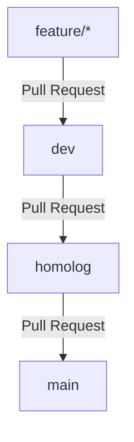

# Padrão de Commits e Fluxo de Branches

Este documento estabelece o padrão de nomenclatura de commits e o fluxo de trabalho do Git (Git Flow) adotado no projeto **Copilot Médico Atualizado**.

---

## 1. Padrão de Mensagens de Commit (Conventional Commits)

Adotamos a especificação dos **Conventional Commits** para manter o histórico do Git legível, organizado e fácil de automatizar. Toda mensagem de commit deve seguir a seguinte estrutura:

```
<tipo>: <descrição sucinta em letras minúsculas>
```

### Tipos de Commits Obrigatórios

#### 🚀 Atualização de Código / Novas Funcionalidades (`feat`)
Use quando for adicionar uma nova funcionalidade ou atualizar uma existente com novas regras de negócio.
* **Exemplo:** `feat: adiciona campo de busca de exames por data`
* **Exemplo:** `feat: implementa integração com a API de voz`

#### 🐛 Correções de Bugs (`fix`)
Use quando estiver corrigindo um erro, bug ou comportamento inesperado no código.
* **Exemplo:** `fix: corrige erro de carregamento no componente PacienteView`
* **Exemplo:** `fix: trata retorno nulo na resposta do servidor de voz`

#### 🧪 Testes (`test`)
Use quando estiver criando, atualizando ou corrigindo testes automatizados (unitários, integração, E2E).
* **Exemplo:** `test: adiciona testes unitários para processador_voz`
* **Exemplo:** `test: corrige testes de integração da rota /auth`

#### 🔧 Outros Tipos Recomendados
* **`chore`**: Mudanças que não modificam o código de produção ou testes (ex: atualizar dependências, alterar arquivos de configuração como `.gitignore` ou `package.json`).
  * *Exemplo:* `chore: adiciona biblioteca axios ao package.json`
* **`refactor`**: Alterações no código que não corrigem bugs nem adicionam funcionalidades, mas melhoram a estrutura ou performance.
  * *Exemplo:* `refactor: modulariza lógica de envio de arquivos em server.py`
* **`docs`**: Alterações exclusivas na documentação do projeto.
  * *Exemplo:* `docs: atualiza instruções de instalação no README.md`
* **`style`**: Mudanças de formatação ou estilo visual que não alteram a lógica (ex: indentação, ponto e vírgula, organização de imports).
  * *Exemplo:* `style: formata código do Sidebar.jsx de acordo com ESLint`

---

## 2. Fluxo de Branches (Estratégia de Ramificação)

Para garantir a estabilidade do produto em produção, dividimos o desenvolvimento em 3 branches principais de ambiente:



### 🔴 `main` (Produção)
* **Objetivo:** Contém o código totalmente estável e pronto para produção.
* **Acesso:** **Altamente restrito.** Apenas o proprietário tem permissão para realizar o deploy ou aceitar merges nesta branch. Ninguém deve commitar diretamente nela.
* **Origem de merges:** Recebe código exclusivamente da branch `homolog` após validação completa.

### 🟡 `homolog` (Homologação / Staging)
* **Objetivo:** Ambiente de testes pré-produção (QA). Serve para validar se tudo funciona exatamente como esperado antes de enviar para o cliente final.
* **Origem de merges:** Recebe pull requests da branch `dev`.

### 🟢 `dev` (Desenvolvimento)
* **Objetivo:** Branch principal de integração do desenvolvimento. Todo novo código funcional desenvolvido no dia a dia é integrado aqui primeiro.
* **Origem de merges:** Recebe pull requests das branches temporárias de features (`feature/*`, `bugfix/*`).

### 🛠️ Branches Temporárias
* **`feature/nome-da-funcionalidade`**: Para novas atualizações e telas.
* **`bugfix/nome-do-bug`**: Para correções de bugs.
* **`test/nome-do-teste`**: Para criação de novos testes.

---

## 3. Como Restringir a Branch `main` no GitHub

Para proteger a branch `main` e garantir que somente você possa fazer alterações nela (ou que todas as alterações passem por aprovação estrita), siga os passos abaixo no GitHub:

1. Acesse o seu repositório no navegador:
   [https://github.com/italobaracho/copilot-medico-atualizado](https://github.com/italobaracho/copilot-medico-atualizado)
2. No menu superior do repositório, clique em ⚙️ **Settings** (Configurações).
3. Na barra lateral esquerda, na seção **Code and automation**, clique em **Branches**.
4. Na seção **Branch protection rules** (Regras de proteção de branch), clique no botão **Add branch protection rule**.
5. Preencha os seguintes campos:
   * **Branch name pattern:** Digite `main`
6. Ative as seguintes opções recomendadas:
   * **Require a pull request before merging:** Isso impedirá pushes diretos (mesmo por você acidentalmente no terminal) e exigirá que toda mudança passe por um Pull Request.
   * **Require approvals:** Se você quiser ser o único a aprovar, ative e defina `Required number of approvals before merging` como `1`.
   * **Restrict who can push to matching branches:** Marque essa opção se quiser definir exatamente quais usuários (apenas você) podem realizar alterações diretas ou aceitar merges na branch.
   * **Do not bypass the above settings:** Garante que mesmo você (como administrador do repositório) tenha que seguir as regras de Pull Request (evitando pushes acidentais diretos por engano).
7. Clique em **Create** (ou **Save changes**) no final da página.

Pronto! Agora a branch `main` está protegida contra alterações acidentais e centraliza o controle sob você.
