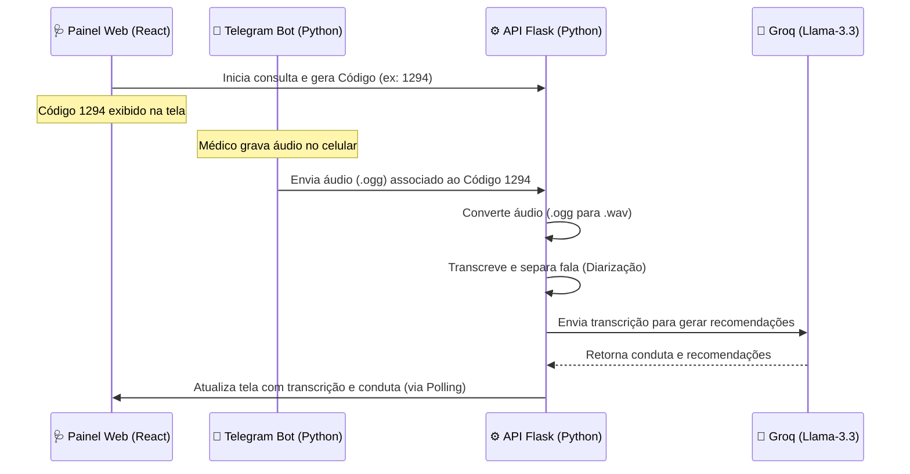

# 📋 Planejamento da 2ª Integração: Copilot Médico + Telegram Bot

Este documento contém o planejamento de arquitetura e a divisão de tarefas (ideal para cadastro no **ClickUp**) para integrar o **Telegram Bot** como capturador de áudio do sistema.

Esta abordagem **substitui a gravação direta pelo microfone do navegador**, o que simplifica drasticamente o frontend (evitando problemas de permissão de microfone) e torna o uso prático: o médico ou paciente grava o áudio pelo próprio celular no Telegram e ele aparece transcrito e diarizado no prontuário!

---

## 🏗️ Como vai funcionar a Integração (Fluxo do Sistema)

1.  **Código de Associação**: Ao iniciar uma consulta na interface React, o sistema gera um código curto (ex: `1294`).
2.  **Envio via Telegram**: O médico abre o bot no celular, digita `1294` (para associar a gravação a essa consulta) e envia uma mensagem de voz.
3.  **Processamento**: O backend Flask recebe a mensagem do Telegram, baixa o arquivo `.ogg`, converte para `.wav`, faz a transcrição com diarização ping-pong ("Médico" e "Paciente") e armazena os dados.
4.  **Atualização**: O frontend React atualiza a tela automaticamente (polling) exibindo as falas formatadas e a sugestão de conduta gerada pela IA.

---

## 📅 Divisão de Tarefas para o ClickUp (Fácil e Direto)

### 💻 BACKEND (2 Desenvolvedores)

---

#### 🟢 Tarefa B1 (Dev 1 - Backend) - Leticia
*   **Título**: `Backend: Criar Bot do Telegram e Recebimento de Áudio`
*   **Objetivo**: Criar o serviço do bot no Telegram que recebe mensagens de voz e faz o download delas.
*   **O que fazer (Passo a Passo)**:
    1.  Criar o bot no Telegram pelo `@BotFather` e obter o Token.
    2.  No backend Flask, inicializar o bot usando a biblioteca `telebot` (`pyTelegramBotAPI`).
    3.  Programar o bot para:
        - Receber mensagens de texto (para capturar o código da consulta, ex: `1294`).
        - Receber mensagens de voz (áudio).
    4.  Ao receber uma mensagem de voz, usar `bot.get_file()` e fazer o download do áudio `.ogg` na pasta `/tmp` do servidor.
*   **Critério de Aceitação**: 
    - Enviar um áudio de voz para o bot no celular e verificar no console do backend que o arquivo foi baixado com sucesso na pasta temporária.

---

#### 🟢 Tarefa B2 (Dev 2 - Backend)
*   **Título**: `Backend: Conversão de Áudio, Diarização e Banco de Dados`
*   **Objetivo**: Converter o arquivo `.ogg` baixado do Telegram para `.wav`, chamar a transcrição/diarização e salvar o log no banco JSON do paciente.
*   **O que fazer (Passo a Passo)**:
    1.  Utilizar a biblioteca `pydub` para converter o arquivo `.ogg` recebido para `.wav` de 16kHz mono (requisito da transcrição).
    2.  Chamar a função de transcrição/diarização (`Diarizador` do `audio_service.py`).
    3.  Salvar o log estruturado de transcrição (`add_transcription_log_to_patient`) no banco de dados local do paciente associado àquela consulta.
*   **Critério de Aceitação**:
    - Após o áudio ser processado, o arquivo `patients_db.json` deve conter os diálogos separados entre "Médico" e "Paciente" salvos no histórico da consulta de código correspondente.

---

### 🎨 FRONTEND (3 Desenvolvedores)

---

#### 🔵 Tarefa F1 (Dev 3 - Frontend)
*   **Título**: `Frontend: Tela de Conexão com o Telegram`
*   **Objetivo**: Desenhar o painel informativo para instruir o médico a enviar o áudio via Telegram.
*   **O que fazer (Passo a Passo)**:
    1.  No painel lateral ou de atendimento, remover os antigos botões de gravação de microfone.
    2.  Inserir um card visual elegante:
        - Ícone do Telegram.
        - Link/Botão clicável que abre o bot (ex: `https://t.me/NomeDoBot`).
        - Instruções simples: *"1. Clique no link e inicie o bot. 2. Envie o código da consulta. 3. Grave seu áudio de voz."*
*   **Critério de Aceitação**:
    - O médico deve ver a seção de instruções do Telegram formatada com CSS limpo e link funcional.

---

#### 🔵 Tarefa F2 (Dev 4 - Frontend)
*   **Título**: `Frontend: Código de Associação da Consulta`
*   **Objetivo**: Gerar e exibir na tela o código único que vincula a consulta ao áudio do Telegram.
*   **O que fazer (Passo a Passo)**:
    1.  Ao criar um atendimento, gerar um número aleatório de 4 dígitos (ex: `1294`).
    2.  Mostrar esse código em destaque na tela (ex: fonte grande e negrito, cor azul chamativa).
    3.  Disponibilizar esse código no backend para que o Telegram Bot consiga validar para qual paciente aquele áudio está sendo enviado.
*   **Critério de Aceitação**:
    - Cada nova consulta iniciada deve exibir um código único e legível na tela.

---

#### 🔵 Tarefa F3 (Dev 5 - Frontend)
*   **Título**: `Frontend: Atualização Automática de Transcrições (Polling)`
*   **Objetivo**: Fazer a tela do prontuário buscar atualizações do backend de tempos em tempos para mostrar as falas assim que a transcrição terminar.
*   **O que fazer (Passo a Passo)**:
    1.  Implementar um `setInterval` no React (Polling) que a cada 5 segundos faz uma chamada `GET /api/patients/<id>/transcription-log` para verificar se há novos textos.
    2.  Assim que o backend retornar os logs de diálogos, desativar o carregamento e desenhar os balões de conversa coloridos na tela.
*   **Critério de Aceitação**:
    - O médico envia o áudio pelo Telegram e, sem precisar atualizar a página manualmente, o texto transcrito em balões de chat (Paciente na esquerda, Médico na direita) aparece na tela em poucos segundos.

---

## 🛠️ Boas Práticas de Branching e Commits (Lembrete para o Time)

*   **Prefixos de Branch**: `feature/telegram-ui`, `fix/conversor-audio`, `feature/telegram-bot`.
*   **Padrão de Commit**:
    - `feat(telegram): criar rota para ler codigo do bot`
    - `fix(conversor): corrigir conversao de ogg para wav`
*   **Fluxo de Merge**: Desenvolvedor faz PR para `dev` ➡️ Testado e integrado na `homolog` via Docker ➡️ **Você (Líder Técnico)** faz o merge final para a `main`.

---

## 🧪 Plano de Testes Manuais Simples

1.  **Associação de Código**: Crie uma consulta na Web, anote o código (ex: `7733`).
2.  **Interação com o Bot**: Pelo Telegram do seu celular, envie o número `7733`. O bot deve responder confirmando a associação.
3.  **Envio do Áudio**: Envie uma mensagem de voz no chat do bot falando *"O paciente relata dor de estômago"*.
4.  **Validação na Tela**: Verifique se na interface React o carregamento inicia e o diálogo com a transcrição aparece em formato de balão.
